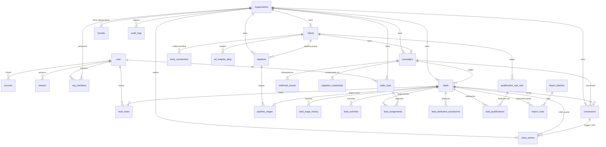

# DATA_MODEL.md — SyncLead v2
**Actualizado:** 2026-09-19 | **Migración:** `drizzle/0002_nifty_serpent_society.sql`

---

## Diagrama ER (compacto)

---

## Tablas

### Auth.js (sin cambios)

| Tabla | Propósito |
|---|---|
| `user` | Usuarios del sistema (Auth.js) |
| `account` | Cuentas OAuth vinculadas |
| `session` | Sesiones activas (solo con strategy=database) |
| `verificationToken` | Tokens de email verification |

---

### Organización y membresía

#### `organizations`
Multi-tenant root. Toda query de negocio debe filtrar por `org_id`.

| Columna | Tipo | Notas |
|---|---|---|
| `id` | uuid PK | |
| `owner_id` | text FK→user.id | CASCADE |
| `name` | text NOT NULL | |
| `slug` | text UNIQUE | URL-friendly |
| `plan` | text | free \| pro \| enterprise |
| `onboarding_completed` | bool | |

#### `org_members` *(v2: FK + enum)*
Un usuario puede pertenecer a múltiples orgs.

| Columna | Tipo | Notas |
|---|---|---|
| `id` | uuid PK | |
| `org_id` | uuid FK→organizations.id | CASCADE |
| `user_id` | text FK→user.id | **v2: FK agregada** CASCADE |
| `role` | member_role | **v2: enum** owner\|admin\|manager\|agent\|viewer |

**Índices:** `UNIQUE (org_id, user_id)` — no duplica membresía.

---

### Clientes y credenciales Meta

#### `clients`
Un cliente = una marca/negocio dentro de una org.

| Columna | Tipo | Notas |
|---|---|---|
| `meta_pixel_id` | text | **@deprecated** → `meta_connections.pixel_id` |
| `meta_access_token_enc` | text | **@deprecated** → `meta_connections.access_token_enc` |
| `meta_dataset_id` | text | **@deprecated** → `meta_connections.dataset_id` |
| `industry` | text | **v2: nuevo** sector del cliente |

#### `meta_connections` *(nuevo)*
Reemplaza los campos Meta en `clients`. Permite múltiples pixels por cliente (futuro).

| Columna | Tipo | Notas |
|---|---|---|
| `pixel_id` | text | nullable (puede ser solo dataset) |
| `dataset_id` | text | nullable |
| `access_token_enc` | text | AES-256-GCM (iv:tag:ciphertext) |
| `key_version` | int | versión de ENCRYPTION_KEY (rotación) |
| `graph_api_version` | text | default v19.0 |
| `status` | meta_connection_status | active\|error\|expired\|pending |
| `scopes` | text[] | permisos conocidos |
| `expires_at` | timestamptz | token expiración (si aplica) |
| `last_verified_at` | timestamptz | última verificación exitosa |
| `last_error` | text | error sanitizado (sin token) |

**Índices:** `UNIQUE (client_id, pixel_id) WHERE pixel_id IS NOT NULL`

---

### Campañas y credenciales de ingesta

#### `campaigns`
| Columna | Notas |
|---|---|
| `api_key` | **@deprecated** → `ingestion_credentials` |

#### `ingestion_credentials` *(nuevo)*
Reemplaza `campaigns.api_key`. El secreto NUNCA se almacena en texto plano.

| Columna | Tipo | Notas |
|---|---|---|
| `key_hash` | text | SHA-256 del secreto real |
| `key_prefix` | text | primeros 12 chars para display |
| `type` | ingestion_credential_type | public_form\|server_secret |
| `status` | ingestion_credential_status | active\|revoked\|expired |
| `rotated_at` | timestamptz | cuándo fue rotada |
| `expires_at` | timestamptz | expiración opcional |

**Lookup:** `SHA256(incoming_key)` → buscar `key_hash` donde `status = 'active'`.
**Índices:** `UNIQUE (key_hash)`, `PARTIAL INDEX ON campaign_id WHERE status = 'active'`

---

### Pipelines (reemplaza funnels)

#### `pipelines` *(nuevo)*
Pipeline relacional. `client_id = NULL` = pipeline de toda la org.

#### `pipeline_stages` *(nuevo)*
| Columna | Tipo | Notas |
|---|---|---|
| `position` | smallint | orden de las etapas |
| `is_won` | bool | etapa terminal de ganado |
| `is_lost` | bool | etapa terminal de perdido |

#### `funnels` *(deprecated)*
Mantiene la UI kanban existente. Migrar a `pipelines` en Prompt 12.

---

### Leads (v2 extendido)

Columnas nuevas en v2:

| Columna | Tipo | Notas |
|---|---|---|
| `current_stage_id` | uuid FK→pipeline_stages | etapa en pipeline relacional |
| `fbclid` | text | Click ID de Facebook |
| `landing_url` | text | URL de destino del anuncio |
| `referrer_url` | text | referrer HTTP |
| `meta_campaign_name` | text | snapshot nombre campaña Meta |
| `meta_adset_name` | text | snapshot nombre ad set |
| `meta_ad_name` | text | snapshot nombre anuncio |
| `external_event_id` | text | v2 canonical (reemplaza `event_id`) |
| `ip_expires_at` | timestamptz | retención: null IP después de esta fecha |
| `ua_expires_at` | timestamptz | retención: null UA después de esta fecha |

Columnas deprecadas (mantenidas para backcompat):

| Columna | Reemplazada por |
|---|---|
| `stage` | `current_stage_id` + `pipeline_stages` |
| `assigned_to`, `assigned_at` | `lead_assignments` |
| `notes` | `lead_notes` |
| `converted`, `conversion_amount`, `conversion_currency`, `conversion_date` | `conversions` |
| `meta_purchase_sent_at`, `meta_purchase_status` | `meta_events` |
| `event_id` | `external_event_id` |

**Índice compuesto nuevo:** `(org_id, campaign_id, created_at)` para queries de dashboard.

---

### Historial, notas y actividad

#### `lead_stage_history` *(sin cambios)*
Historial de cambios de campo (temperature, stage, assignedTo).

#### `lead_notes` *(nuevo)*
Múltiples notas por lead con autoría. Reemplaza `leads.notes` (campo único).

#### `lead_activities` *(nuevo)*
Trail estructurado para UI de timeline. `metadata` sanitizado (sin PII).

| Tipo actividad | Cuándo |
|---|---|
| `created` | Al ingestar |
| `stage_changed` | Cambio de etapa |
| `temperature_changed` | Cambio de temperatura |
| `note_added` | Nueva nota |
| `assigned` | Asignación a rep |
| `converted` | Registro de venta |
| `meta_event_sent` | CAPI event enviado |

---

### Asignación

#### `sales_reps` *(nuevo)*
Perfil de vendedor. Puede o no tener cuenta de usuario (`user_id` nullable).

#### `lead_assignments` *(nuevo)*
Historial de asignaciones. Solo una vigente por lead.

**Constraint crítico:** `UNIQUE INDEX ON lead_id WHERE is_current = true`

Proceso de reasignación:
1. `UPDATE lead_assignments SET is_current=false, unassigned_at=NOW() WHERE lead_id=X AND is_current=true`
2. `INSERT INTO lead_assignments (lead_id, sales_rep_id, is_current=true)`

---

### Atribución multi-touch

#### `lead_attribution_touchpoints` *(nuevo)*
Preserva first-touch y last-touch sin sobrescribir `leads.utm_*` (snapshot de ingest).

| touch_type | Cuándo registrar |
|---|---|
| `first_touch` | Al ingestar el lead |
| `last_touch` | En cada nuevo contacto/visit |
| `assist` | Touchpoints intermedios |

---

### Calificación

#### `qualification_rule_sets` *(nuevo)*
Reglas versionadas por org (o por cliente). `rules` es JSONB con la definición.

#### `lead_qualifications` *(nuevo)*
Resultado de evaluación: `score`, `qualified`, override manual con razón.

---

### Conversiones y CAPI

#### `conversions` *(nuevo)*
Separada de `leads`. Permite múltiples ventas, cancelaciones y reembolsos.

| Columna | Tipo | Notas |
|---|---|---|
| `amount` | numeric(12,2) | nunca float |
| `status` | conversion_status | pending\|confirmed\|cancelled\|refunded |
| `order_id` | text | idempotencia externa |

**Constraint:** `UNIQUE (org_id, order_id) WHERE order_id IS NOT NULL`

#### `meta_events` *(nuevo — outbox pattern)*
Cola de eventos CAPI con reintentos. El `payload` contiene PII ya hasheado.

| Estado | Descripción |
|---|---|
| `pending` | Esperando envío |
| `sent` | Enviado exitosamente |
| `failed` | Agotó reintentos |
| `skipped` | Saltado (duplicado detectado) |

**Índice parcial:** `ON next_attempt_at WHERE status = 'pending'` — para el worker de reintentos.

---

### Ads Insights y sincronización

#### `ad_insights_daily` *(nuevo)*
Datos de Meta Ads Insights API. Upsert-safe con unique parcial por ad+fecha.

#### `meta_sync_runs` *(nuevo)*
Log de ejecuciones de sincronización con Meta Ads.

---

### Importación

#### `import_batches` *(nuevo)*
Lote de importación (CSV, Google Sheets, API).

#### `import_rows` *(nuevo)*
Fila individual con su status y lead resultante.

---

### Auditoría

#### `audit_logs` *(nuevo)*
Tabla append-only. `ip_redacted` enmascara el último octeto: `192.168.1.xxx`.

---

### Idempotencia existente (sin cambios)

#### `webhook_events`
Deduplicación de webhooks entrantes por `event_id`.

---

## Columnas deprecadas — tabla de compatibilidad legado → v2

| Tabla | Columna legada | Estado | Reemplazada por | Cuándo eliminar |
|---|---|---|---|---|
| `clients` | `meta_pixel_id` | deprecated | `meta_connections.pixel_id` | Prompt 13+ |
| `clients` | `meta_access_token_enc` | deprecated | `meta_connections.access_token_enc` | Prompt 13+ |
| `clients` | `meta_dataset_id` | deprecated | `meta_connections.dataset_id` | Prompt 13+ |
| `campaigns` | `api_key` | deprecated | `ingestion_credentials.key_hash` | Prompt 13+ |
| `leads` | `stage` | deprecated | `leads.current_stage_id` + `pipeline_stages` | Prompt 12+ |
| `leads` | `assigned_to`, `assigned_at` | deprecated | `lead_assignments` | Prompt 12+ |
| `leads` | `notes` | deprecated | `lead_notes` | Prompt 12+ |
| `leads` | `converted` | deprecated | `conversions.status = 'confirmed'` | Prompt 12+ |
| `leads` | `conversion_amount`, `conversion_currency`, `conversion_date` | deprecated | `conversions.amount/currency/converted_at` | Prompt 12+ |
| `leads` | `meta_purchase_sent_at`, `meta_purchase_status` | deprecated | `meta_events.status` | Prompt 12+ |
| `leads` | `event_id` | deprecated | `leads.external_event_id` | Prompt 12+ |
| `funnels` | tabla completa | deprecated | `pipelines` + `pipeline_stages` | Prompt 12+ |

---

## Enums PostgreSQL creados

| Enum | Valores |
|---|---|
| `member_role` | owner, admin, manager, agent, viewer |
| `meta_connection_status` | active, error, expired, pending |
| `ingestion_credential_type` | public_form, server_secret |
| `ingestion_credential_status` | active, revoked, expired |
| `attribution_touch_type` | first_touch, last_touch, assist |
| `conversion_status` | pending, confirmed, cancelled, refunded |
| `meta_event_status` | pending, sent, failed, skipped |
| `import_batch_status` | pending, processing, completed, failed |
| `import_row_status` | pending, imported, duplicate, failed |
| `audit_actor_type` | user, system, api |
| `lead_activity_type` | created, stage_changed, temperature_changed, note_added, assigned, converted, conversion_cancelled, meta_event_sent, imported, qualified, tagged |

---

## Índices parciales críticos (garantías en DB)

| Tabla | Índice | Condición | Garantía |
|---|---|---|---|
| `lead_assignments` | `lead_assignments_current_idx` UNIQUE | `WHERE is_current = true` | Solo 1 asignación activa por lead |
| `conversions` | `conversions_org_order_idx` UNIQUE | `WHERE order_id IS NOT NULL` | Idempotencia de ventas externas |
| `meta_events` | `meta_events_pending_idx` | `WHERE status = 'pending'` | Queue scan eficiente |
| `meta_connections` | `meta_connections_client_pixel_idx` UNIQUE | `WHERE pixel_id IS NOT NULL` | No duplica pixel por cliente |
| `ad_insights_daily` | `ad_insights_ad_date_idx` UNIQUE | `WHERE meta_ad_id IS NOT NULL` | Upsert seguro por anuncio+día |
| `ingestion_credentials` | `ingestion_cred_active_idx` | `WHERE status = 'active'` | Lookup rápido de credenciales activas |

---

## Custom Fields — Postergado

`custom_field_definitions` y `custom_field_values` no están implementadas.
**Razón:** Aumentan complejidad de queries de filtrado/índices sin demanda actual.
**Alternativa actual:** El campo `leads.notes` (libre) y el JSONB `lead_activities.metadata` cubren casos ad-hoc.
**Cuándo implementar:** Cuando >= 3 clientes pidan campos configurables por formulario.

---

## Notas de seguridad del modelo

1. `meta_connections.access_token_enc` — AES-256-GCM, nunca en texto plano. Descifrar solo en server actions.
2. `ingestion_credentials.key_hash` — SHA-256, nunca el secreto real.
3. `lead_activities.metadata` — sanitizado, sin PII. Los cambios de stage/temp se registran como valores (ej. "cold" → "warm"), no como nombres o teléfonos.
4. `audit_logs.ip_redacted` — último octeto enmascarado.
5. `meta_events.payload` — PII ya hasheado antes de insertar (email, phone, name, city como SHA-256).
6. `leads.ip_expires_at`, `leads.ua_expires_at` — política de retención. El cron de limpieza debe nullificar estos campos cuando expire.
